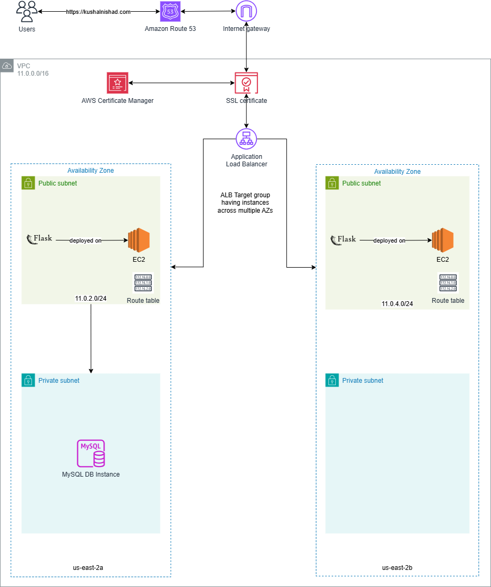

## Friend's Spending Tracker: Automated CI/CD Deployment of Python Flask application with Jenkins

## 📑 Table of Contents
1. [AWS Flask App Infra Setup](#AWS-Flask-App-Infra-Setup)
   - [🖼️ Architecture Diagram](#Architecture-Diagram)
   - [📁 Project Structure](#Project-Structure)
   - [🔧 Setup Instructions](#Setup-Instructions)
   - [📷 Demo Screenshots](#Demo-Screenshots)
   - [🧠 Learnings (Best practices)](#Learnings)

## Architecture Diagram
📝 Note: The diagram below demonstrates a high availability setup by deploying EC2 instances across multiple subnets (e.g., us-east-1a and us-east-1b). However, for this project, the Terraform code provisions a single Python Flask instance in us-east-2a. The diagram is intended solely to help visualize the concept of high availability.



## AWS Flask App Infra Setup
```markdown
This repository contains Terraform configurations and CI/CD pipelines to provision and manage AWS infrastructure for
deploying a Flask-based Python application in us-east-2. It supports both automated provisioning and deployment using Jenkins.

🚀 Features

- 🏗️ Infrastructure-as-Code with Terraform
- ☁️ Deploys to AWS using EC2, VPC, Subnets, Security Groups, ALB, RDS, Route 53, and Certificate Manager
- 🔐 Secure credential management via Jenkins Credentials
- 🛠️ CI/CD automation with Jenkins Pipeline
- 📦 Modular and reusable Terraform code
```

## Project Structure
```
├── terraform-infra-setup/
│   ├── modules/
│   │   ├── certificate-manager/           # ACM certificate provisioning
│   │   ├── hosted-zone/                   # Route 53 hosted zone setup
│   │   ├── jenkins/                       # EC2 instance setup for Jenkins
│   │   ├── load-balancer/                 # Load Balancer
│   │   ├── load-balancer-target-group/    # Load Balancer Target Group
│   │   ├── networking/                    # VPC, subnets, route tables
│   │   ├── rds/                           # MySQL for persistent storage
│   │   ├── security-groups/               # Security group definitions
│   │   ├── user-data-script/              # Script to install Python Flask application on EC2
│   ├── main.tf                            # Root Terraform config
│   ├── outputs.tf                         # Output variables
│   ├── provider.tf                        # Provider configuration
│   ├── terraform.tfvars                   # Variable values
│   ├── variables.tf                       # Input variables
└── Jenkinsfile                            # Jenkins pipeline script
└── README.md                              # You're here

```

## Prerequisites
```
- AWS account with programmatic access (IAM user with permissions)
- Terraform CLI (v1.3+ recommended)
- Jenkins server installation script
```

## Setup Instructions to run without CI/CD Pipeline

### 1. Clone the Repository
```
bash
git clone https://github.com/KushalNishad/AWS-Flask-App-Infra-Setup.git
cd AWS-Flask-App-Infra-Setup
```

### 2. Initialize Terraform
```bash
terraform init
```

### 3. Plan and Apply Infrastructure
```bash
terraform plan
terraform apply
```

### 4. Tear Down 🧹

To destroy all resources:
```bash
terraform destroy
```

## CI/CD Pipeline (Jenkins)

### 1. Install Jenkins on EC2
Follow GitHub Repo: https://github.com/KushalNishad/AWS-Jenkins-Infra-Setup.git to deploy Jenkins server first.

### 2. Define sensitive Terraform variabes in Jenkins Global credentials


- aws-credentials-kushal: Stores the AWS Access Key ID and Secret Access Key in Jenkins.
   - Jenkins executes Terraform commands on agents or containers. Since Terraform interacts with AWS to provision resources, Jenkins requires        these credentials to authenticate and authorize AWS API calls.
   - Requires **AWS Steps** plugin for integration.
- mysql-db-login-credentials: Stores MySQL username and password used by Terraform to create an RDS instance.
- ssh_private_key: Used for SSH/SCP access to the EC2 instance hosting the Flask app.
- ssh_public_key: Assigned to the EC2 instance for SSH authentication.

### 3. Create and run Jenkins Pipeline
- - Start the Jenkins pipeline by configuring SCM as GitHub to fetch the Jenkinsfile.
  - No credentials needed as the project GitHub repository is public.


## Demo Screenshots


## Troubleshooting and Optimization Tips for the Project

Solutions that Helped Me Solve the Problems I Encountered While Working on This Project

1. **Set Correct AMI ID for Different Regions**
   - AWS AMI IDs differ across regions. Ensure that the correct AMI ID is specified in the `terraform.tfvars` file for both the Jenkins and Flask infrastructures. This will ensure the proper AMI is used when deploying resources in different regions.

2. **Use `TF_VAR_variable_name` for Sensitive Information**
   - Use `TF_VAR_variable_name = "Secret information like public key"` to avoid checking sensitive information in version control. Alternatively, you can use AWS KMS to perform the same task.

3. **Save All Files Before Managing Dependencies**
   - While working with Terraform files in VSCode, it's easy to forget to save changes before applying Terraform plans. To avoid this issue, make sure to use the following shortcut before applying the plan:
     - Shortcut: `Ctrl + K S`
     - This command will save all files at once, ensuring that all changes are captured before applying the Terraform plan.

4. **Format Terraform Files**
   - To maintain a clean and consistent codebase, always format your Terraform files. Use the following command to format all Terraform files recursively:
     - Command: `terraform fmt -recursive`

5. **Deploy Jenkins and Flask in Different Regions**
   - To prevent duplication issues for global services like Route 53, deploy Jenkins infrastructure and the Python Flask application in separate AWS regions. This approach ensures that services do not overlap, avoiding conflicts related to region-specific resources.

6. **Use a `.gitignore` File**
   - To protect sensitive information and prevent accidental exposure of private data, ensure that you have a `.gitignore` file in your repository. This will prevent sensitive files from being uploaded to public repositories like GitHub.

7. **Git Workflow: Pull Before Making Changes**
   - Always ensure that you sync your local repository with the latest changes from the remote repository. Run `git pull` before making any changes to avoid conflicts and ensure you're working on the most up-to-date version of the codebase.

8. **Clean Up Zone.Identifier Files on Windows**
   - Sometimes, Windows creates `Zone.Identifier` files when copying files from the internet. To find and delete these files, run the following commands:
     - Find: `find . -name "*Zone.Identifier*"`
     - Delete: `find . -name "*Zone.Identifier*" -exec rm -f {} \;`

9. **Check Flask Application on Port 5000**
   - If your Flask application is running on port 5000, you can use the following command to check if it's active:
     - Command: `sudo lsof -i :5000`
   - This will show if the Flask application is successfully running on port 5000.

10. **Resolve WSL Connection Issues with GitHub**
    - If you're using WSL on Windows and encounter the following error when connecting to GitHub:
      ```
      Error Message: wsl Exiting, name server cannot be used: Temporary failure in name resolution (-3)
      ```
      Use the following steps to resolve it:
      1. Add Google's public DNS server to the `/etc/resolv.conf`:
         - `nameserver 8.8.8.8`
      2. Restart the service:
         - `sudo systemctl restart systemd-resolved.service`
      3. To prevent the DNS configuration from being overwritten on WSL restart, add the following to `/etc/wsl.conf`:
         ```ini
         [network]
         generateResolvConf = false
         ```

11. **Fix Load Balancer Listener Port for Flask Application**
    - If the Load Balancer listener is set to port 5000 for your Flask application, it might not work properly on mobile browsers when accessed via domain name (e.g., `https://kushalnishad.com`). To resolve this, update the listener port to 80 in the Load Balancer configuration (`main.tf`):
      - Update: Set `lb_listener_port = 80`

## 📝 To-Do

- [ ] Integrate Docker and ECS
- [ ] Add monitoring (CloudWatch / Prometheus)

## 🙋‍♂️ Author
**Kushal Nishad**  
🔗 [GitHub](https://github.com/KushalNishad) | [LinkedIn](https://www.linkedin.com/in/kushal-nishad/)
